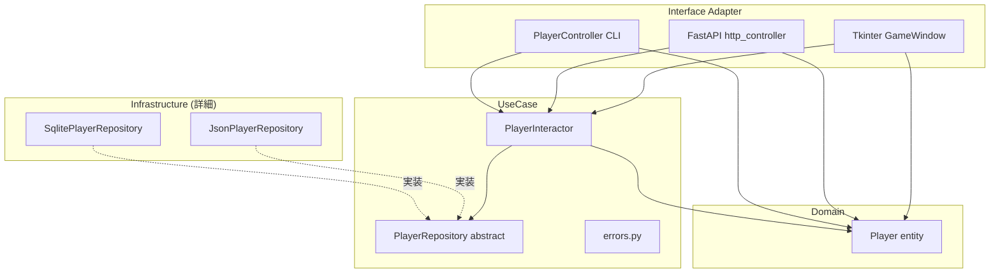

# 01. アーキテクチャ設計

## 1. 目的

本プロジェクトは「クリーンアーキテクチャ」を学習するためのサンプル実装である。
以下の3条件をクリーンアーキテクチャの原則を保ったまま満たすことを設計目標とする。

| 条件 | 実現方法 |
|------|----------|
| User データを **DB に対して CRUD** できる | `SqlitePlayerRepository`（Infrastructure層） |
| User データを **JSON でローカルに CRUD** できる | `JsonPlayerRepository`（Infrastructure層） |
| **DI** により上記2つを切り替えられる | `src/container.py`（合成ルート）で実装選択 |

加えて、「学習対象がただのCRUDだと面白くない」という観点から、
セーブデータを **放置型RPGのプレイヤー** として扱うゲーム化を行い、
さらに入出力チャネルを **CLI / REST API / GUI** の3種類に拡張している。
入出力やゲーム化を後付けしても、内側のコード（Domain/UseCase）は1行も変わっていない
ことが、本サンプルの最重要メッセージである。

---

## 2. 設計原則（4つ）

### 2.1 依存ルール（The Dependency Rule）

**ソースコードの依存関係は、内側にのみ向かねばならない。**

```
依存OK:     Infrastructure → Adapter → UseCase → Domain
依存NG:     Domain → UseCase     (内側が外側を知ってしまう)
依存NG:     UseCase → Infrastructure  (具体実装に依存してしまう)
```

このルールが破れていないかは、各 `.py` の `import` 文だけを見れば検証できる。

### 2.2 依存性逆転の原則（DIP: Dependency Inversion Principle）

UseCase が「保存先」を必要とするが、Infrastructure に直接依存させると
依存ルールに違反する。そこで **抽象（ポート）を UseCase 側に置く**：

```
UseCase ─── 定義 ───▶ PlayerRepository (抽象クラス)
                              ▲
                              │ 実装
                              │
Infrastructure ──────────────┘  (SqlitePlayerRepository / JsonPlayerRepository)
```

矢印は **Infrastructure → UseCase** に向き、依存ルールを守れる。
これが「依存の逆転」と呼ばれる所以。

### 2.3 関心の分離（Separation of Concerns）

層ごとに関心事を限定する：

| 層 | 関心事 | 知ってよいもの | 知ってはいけないもの |
|----|--------|---------------|---------------------|
| Domain | 「正しい状態とは何か」「ゲーム規則」 | 標準ライブラリのみ | DB / HTTP / GUI / 時計 |
| UseCase | 「業務手順」「アプリ規則」 | Domain + 自分のポート | DB実装 / FastAPI / Tkinter |
| Adapter | 「外部表現への変換」 | UseCase + Domain | 具体リポジトリ実装 |
| Infrastructure | 「外部技術の詳細」 | UseCase（ポート） + Domain | 他の Infrastructure 実装 |

### 2.4 置換可能性（Substitutability）

抽象に依存しておけば、実装は何度でも差し替えられる。
本プロジェクトでは以下を実際に差し替える：

| 差し替え対象 | 抽象 | 実装A | 実装B |
|-------------|------|-------|-------|
| 保存先 | `PlayerRepository` | `SqlitePlayerRepository` | `JsonPlayerRepository` |
| 時計 | `Callable[[], float]` | `time.time` | `FakeClock`（テスト用） |
| 入出力チャネル | （Adapterそれ自体） | CLI | REST API / GUI |

これらの差し替えのために UseCase / Domain は1行も変更しない。

---

## 3. 4層構成

### 3.1 Domain層 — 最も内側

- **置き場所**: `src/domain/`
- **代表**: `Player` エンティティ
- **責務**: 業務の核となる規則（自己検証、レベルアップ計算、戦闘力導出）
- **import 制約**: 標準ライブラリのみ。`src/usecase` も `src/infrastructure` も触らない

### 3.2 UseCase層（Application Business Rules）

- **置き場所**: `src/usecase/`
- **代表**: `PlayerInteractor`, `PlayerRepository`（抽象）, 業務例外
- **責務**: アプリケーション固有の業務手順（登録、放置精算、冒険、改名、引退）
- **import 制約**: `src/domain` のみ。具体実装は知らない

### 3.3 Interface Adapter層

- **置き場所**: `src/adapter/`
- **代表**: `PlayerController`（CLI）, `create_app`（HTTP）, `GameWindow`（GUI）
- **責務**: 外部表現（CLI文字列 / JSON / Tkinter ウィジェット）と UseCase の橋渡し
- **import 制約**: `src/usecase`, `src/domain`、および自分の専門ライブラリ（FastAPI / Tkinter）

### 3.4 Infrastructure層 — 最も外側

- **置き場所**: `src/infrastructure/`
- **代表**: `SqlitePlayerRepository`, `JsonPlayerRepository`
- **責務**: 永続化技術（sqlite3 / json）の詳細を閉じ込め、ポートを実装
- **import 制約**: ポート（`src/usecase/repository.py`）と `src/domain` のみ

### 3.5 合成ルート（Composition Root）

- **置き場所**: `src/container.py`, `main.py`, `api.py`, `gui.py`
- **責務**: 具体実装の選択と依存の注入。**ここだけが全層を知る**
- これは「層」ではなく、層を組み立てるための特別な場所

---

## 4. 同心円図

```
   ┌─────────────────────────────────────────────────────┐
   │ Infrastructure (詳細・外側)                          │
   │   sqlite_repository.py / json_repository.py          │
   │                                                      │
   │   ┌─────────────────────────────────────────────┐    │
   │   │ Interface Adapter                           │    │
   │   │   controller.py      (CLI)                  │    │
   │   │   http_controller.py (FastAPI)              │    │
   │   │   gui_view.py        (Tkinter GUI)          │    │
   │   │                                             │    │
   │   │   ┌─────────────────────────────────────┐   │    │
   │   │   │ UseCase (ゲーム手順・業務規則)      │   │    │
   │   │   │   player_interactor.py              │   │    │
   │   │   │   repository.py    (ポート/抽象)    │   │    │
   │   │   │   errors.py        (業務例外)       │   │    │
   │   │   │                                     │   │    │
   │   │   │   ┌─────────────────────────────┐   │   │    │
   │   │   │   │ Domain (ゲーム規則・最内側)  │  │   │    │
   │   │   │   │   player.py                 │   │   │    │
   │   │   │   └─────────────────────────────┘   │   │    │
   │   │   └─────────────────────────────────────┘   │    │
   │   └─────────────────────────────────────────────┘    │
   └─────────────────────────────────────────────────────┘

                        ↑
                依存はすべてこの方向（外→内）
```

Mermaid版（GitHub上で図として表示される）:



---

## 5. このプロジェクトでの層マッピング

| ファイル | 層 | 主要シンボル |
|---------|-----|------------|
| `src/domain/player.py` | Domain | `Player` |
| `src/usecase/repository.py` | UseCase | `PlayerRepository`（抽象） |
| `src/usecase/player_interactor.py` | UseCase | `PlayerInteractor`, `IdleReward`, `AdventureResult` |
| `src/usecase/errors.py` | UseCase | `PlayerNotFoundError`, `NameAlreadyExistsError` |
| `src/adapter/controller.py` | Adapter | `PlayerController`（CLI） |
| `src/adapter/http_controller.py` | Adapter | `create_app`, `PlayerOut` 等の Pydantic DTO |
| `src/adapter/gui_view.py` | Adapter | `GameWindow`（Tkinter） |
| `src/infrastructure/sqlite_repository.py` | Infrastructure | `SqlitePlayerRepository` |
| `src/infrastructure/json_repository.py` | Infrastructure | `JsonPlayerRepository` |
| `src/container.py` | 合成 | `build_repository`, `build_interactor`, `build_controller`, `build_app`, `build_gui` |
| `main.py`, `api.py`, `gui.py` | 合成ルート | エントリポイント |

---

## 6. 依存方向の検証

各 `.py` の `import` 文だけを見れば、依存ルール違反の有無を機械的に確認できる。

| ファイル | 許可される import 元 | 実際の状況 |
|----------|--------------------|-----------|
| `src/domain/player.py` | 標準ライブラリのみ | ✅ `dataclasses` のみ |
| `src/usecase/*.py` | `src.domain.*` | ✅ |
| `src/adapter/*.py` | `src.usecase.*`, `src.domain.*` + 自分の専門lib | ✅ |
| `src/infrastructure/*.py` | `src.usecase.*`, `src.domain.*` + 自分の専門lib | ✅ |
| `src/container.py` | 全層（合成ルートだから許される） | ✅ |
| `main.py` / `api.py` / `gui.py` | `src.container` のみ | ✅ |

検証コマンド例（grepで内側が外側を import していないかチェック）：

```bash
# Domain が外側を import していないか
grep -rn "from src\." src/domain/  # 何も出ないのが正解

# UseCase が Infrastructure を import していないか
grep -rn "src\.infrastructure" src/usecase/  # 何も出ないのが正解
```

---

## 関連ドキュメント

- 02_components.md — 各ファイルの責務を file-by-file で記述
- 03_di.md — DI の具体的な仕組み
- 04_use_cases.md — ユースケース別の業務規則とフロー
- 05_testing.md — テスト戦略
