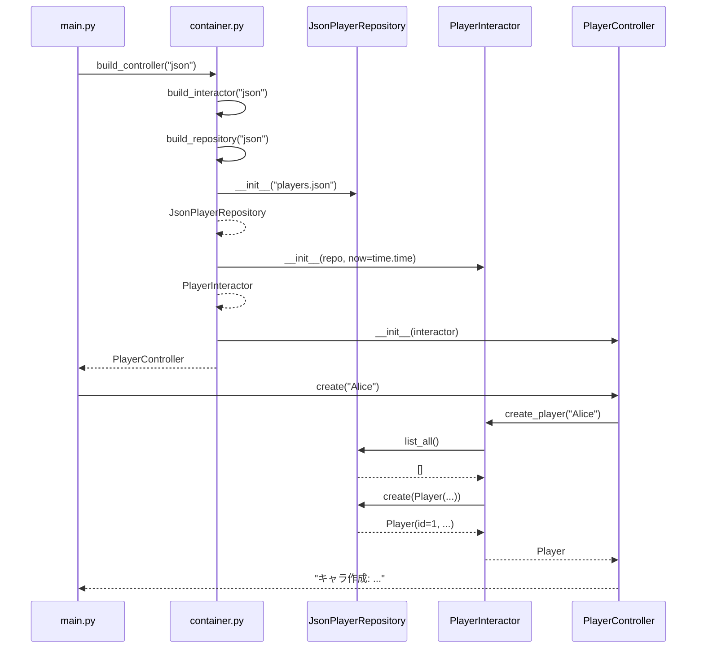

# 03. Dependency Injection 設計

## 1. なぜ DI か

DI（依存性注入）を採用する目的は次の2つに尽きる。

1. **置換可能性** — UseCase コードを変えずに、保存先や時計を差し替えられる
2. **テスト容易性** — 本物のDB/HTTPサーバ/時計なしに、UseCase をユニットテストできる

本プロジェクトでは「3条件（DB/JSON CRUD + DI切替）」を満たす中核機構として DI を使う。

---

## 2. 採用方式: コンストラクタ・インジェクション

メソッド/プロパティ注入や、サービスロケータ・グローバル変数 ではなく、
**コンストラクタの引数として依存を渡す**方式を採用する。

```python
class PlayerInteractor:
    def __init__(
        self,
        repository: PlayerRepository,   # ← ポート(抽象)を受け取る
        now=time.time,                  # ← 時計も注入可能
        idle_exp_per_sec: float = 5.0,  # ← バランス値も注入できる
        ...
    ) -> None:
        self._repo = repository
        self._now = now
        ...
```

理由：

- **依存関係が型シグネチャに明示される** → 何に依存しているか一目瞭然
- **オブジェクト生成時に整合性が決まる** → 後から差し替わって壊れる事故が起きにくい
- **テストで Mock/Fake を差し込みやすい**

---

## 3. 注入対象

### 3.1 `PlayerRepository`（保存先）

抽象 `src/usecase/repository.py::PlayerRepository`。実装は2種類。

| 実装 | 場所 | 保存先 |
|------|------|--------|
| `SqlitePlayerRepository` | `src/infrastructure/sqlite_repository.py` | SQLite ファイル / インメモリ |
| `JsonPlayerRepository` | `src/infrastructure/json_repository.py` | ローカル JSON ファイル |

これらは `PlayerRepository` を継承して同じシグネチャを提供する。
**UseCase は具体クラスを名前で知らない** ため、コンパイル時依存はゼロ。

### 3.2 `now`（時計）

`Callable[[], float]`。デフォルトは `time.time`。
放置時間の計算で `self._now()` を呼ぶ。

| 実装 | 用途 |
|------|------|
| `time.time` | 本番（実時間） |
| `FakeClock` | テスト（任意の時刻を返せる） |

```python
# テスト例
clock = FakeClock(start=1000.0)
interactor = PlayerInteractor(repo, now=clock)
clock.tick(7200)         # 2時間進める
interactor.login(pid)    # 7200秒放置として精算される
```

### 3.3 バランス値（設計上の注入対象）

`idle_exp_per_sec`, `idle_gold_per_sec`, `idle_cap_seconds` も
コンストラクタ引数化されている。これにより：

- テストでは小さな値を使い、計算結果を検証しやすい
- 本番では運営調整値を設定ファイルから読み込める（将来拡張）

---

## 4. 合成ルート（Composition Root）

「具体実装の選択」と「依存の組み立て」を1箇所に集中させる場所。

### 4.1 場所

| ファイル | 役割 |
|---------|------|
| `src/container.py` | ファクトリ関数群（部品の組み立て） |
| `main.py` | CLI エントリ |
| `api.py` | REST API エントリ（uvicorn 起動） |
| `gui.py` | GUI エントリ（Tk mainloop） |

合成ルート以外の場所で、具体クラスを `new` してはいけない。

### 4.2 ファクトリ階層

```
                       (backend: str, now)
                              │
                              ▼
                    ┌────────────────────┐
                    │ build_repository   │  ──► SqlitePlayerRepository
                    │                    │  ──► JsonPlayerRepository
                    └────────────────────┘
                              │ (PlayerRepository)
                              ▼
                    ┌────────────────────┐
                    │ build_interactor   │  ──► PlayerInteractor
                    └────────────────────┘
                              │ (PlayerInteractor)
                  ┌───────────┼───────────┐
                  ▼           ▼           ▼
            build_controller  build_app   build_gui
            ▼                 ▼           ▼
            PlayerController  FastAPI app GameWindow
            (CLI)             (HTTP)      (Tkinter)
```

### 4.3 実装抜粋

```python
# src/container.py

def build_repository(backend: str) -> PlayerRepository:
    if backend == "sqlite":
        return SqlitePlayerRepository(db_path="players.db")
    if backend == "json":
        return JsonPlayerRepository(file_path="players.json")
    raise ValueError(f"未知のbackend: {backend!r}")


def build_interactor(backend: str, now=time.time) -> PlayerInteractor:
    repository = build_repository(backend)
    return PlayerInteractor(repository, now=now)


def build_controller(backend: str, now=time.time) -> PlayerController:
    return PlayerController(build_interactor(backend, now=now))


def build_app(backend: str, now=time.time):
    from src.adapter.http_controller import create_app
    return create_app(build_interactor(backend, now=now))


def build_gui(backend: str, now=time.time):
    import tkinter as tk
    from src.adapter.gui_view import GameWindow
    root = tk.Tk()
    GameWindow(root, build_interactor(backend, now=now), backend_label=backend)
    return root
```

---

## 5. 依存組立てフロー（シーケンス）

`python main.py json` 実行時の組立てシーケンス：



ポイント：
- `Repo` の **具体型を知るのは Container だけ**
- `Interactor` は `Repo` を `PlayerRepository` として扱う
- `Ctrl` は `Interactor` を呼ぶだけ

---

## 6. 切替パターンの一覧

### 6.1 backend 切替

| コマンド | 内部で何が起こるか |
|---------|------------------|
| `python main.py sqlite` | `build_repository("sqlite")` → `SqlitePlayerRepository("players.db")` |
| `python main.py json` | `build_repository("json")` → `JsonPlayerRepository("players.json")` |
| `python api.py sqlite` | 同上の Repository を `create_app()` 経由で FastAPI に注入 |
| `python gui.py json` | 同上の Repository を `GameWindow` に注入 |

### 6.2 時計切替

| 用途 | now の値 |
|------|---------|
| 本番 | `time.time`（デフォルト） |
| テスト | `FakeClock(start=1000.0)` を渡す |
| デモ | `main.py --demo` で擬似時計を注入し2時間放置を再現 |

### 6.3 入出力チャネル切替

| エントリ | UseCase は同じ | Adapter |
|---------|--------------|---------|
| `main.py` | `PlayerInteractor` | `PlayerController`（CLI） |
| `api.py` | `PlayerInteractor` | `create_app`（FastAPI） |
| `gui.py` | `PlayerInteractor` | `GameWindow`（Tkinter） |

「UseCase は同じ」がポイント。これにより 3 つの入出力が **同じ業務ルール** で動く。

---

## 7. なぜ DI コンテナライブラリ（dependency-injector等）を使わないか

本プロジェクトでは標準ライブラリ範囲で DI を実現している。理由：

- 学習目的では「DI は単にコンストラクタに渡すだけ」という本質が見えやすい
- 依存関係が少なく、ライブラリの仕組みを覚えるコストが学習を阻害する
- 将来必要になれば `container.py` のファクトリ関数を、ライブラリ呼び出しに置き換えるだけ
  （Adapter/UseCase/Domain の改変不要）

---

## 関連ドキュメント

- 01_architecture.md — 設計原則と層構成
- 02_components.md — 各ファイルの責務
- 05_testing.md — テストでの注入実例
