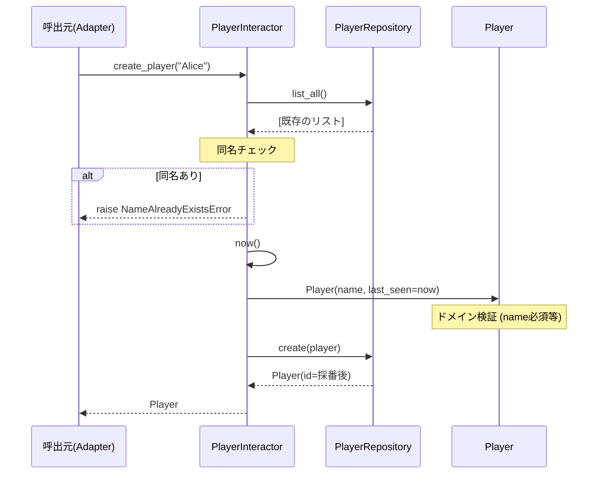
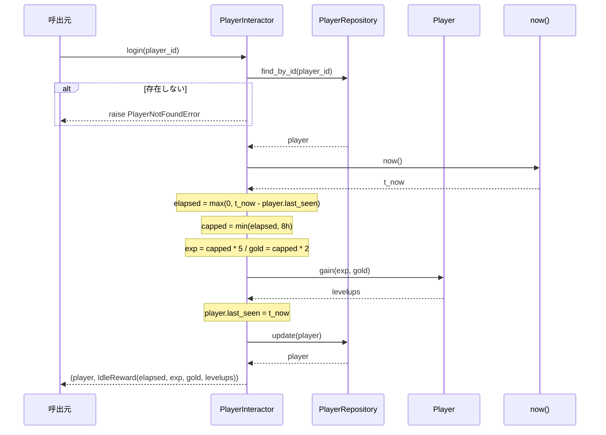

# 04. ユースケース仕様

CRUD と放置型RPGゲーム操作の対応、業務規則、各ユースケースのシーケンスを記述する。

## 1. CRUD ↔ ゲーム操作 対応表

| CRUD | ゲーム操作 | UseCase メソッド | 主な業務動作 |
|------|-----------|------------------|------------|
| **C**reate | キャラ作成 | `create_player(name)` | 同名チェック、Player生成、保存 |
| **R**ead | ステータス確認 | `get(player_id)` | 1件取得 |
| **R**ead | ランキング | `ranking()` | Lv→exp降順ソート |
| **U**pdate | 放置報酬の精算 | `login(player_id)` | last_seenからの経過に応じて報酬付与 |
| **U**pdate | 冒険 | `adventure(player_id)` | 固定式で即時報酬付与 |
| **U**pdate | 改名 | `rename(player_id, new_name)` | 名前変更＋ドメイン再検証 |
| **D**elete | 引退 | `retire(player_id)` | 存在確認後に削除 |

## 2. 業務規則一覧

### 2.1 ドメイン規則（Player エンティティで保証）

| 規則 | 条件 | 違反時 |
|------|------|--------|
| 名前必須 | `name` が空白でない | `ValueError("name は必須です")` |
| レベル下限 | `level >= 1` | `ValueError("level は 1 以上です")` |
| 経験値/ゴールド非負 | `exp >= 0 and gold >= 0` | `ValueError("exp / gold は非負です")` |
| 報酬非負 | `gain(exp, gold)` の引数が非負 | `ValueError("報酬は非負である必要があります")` |

### 2.2 アプリケーション規則（UseCase で保証）

| 規則 | 条件 | 違反時 |
|------|------|--------|
| 同名禁止 | 新規作成時に同名が存在しない | `NameAlreadyExistsError` |
| 存在確認 | get/login/adventure/rename/retire 時に id が存在 | `PlayerNotFoundError` |

### 2.3 ゲームバランス規則

| 項目 | 計算式 | 注入可否 |
|------|--------|----------|
| 次レベル必要経験値 | `level * 100` | 静的（Player.exp_to_next） |
| 戦闘力 | `level * 10` | 静的（Player.power） |
| 放置経験値/秒 | 既定 5.0 | コンストラクタ注入 |
| 放置ゴールド/秒 | 既定 2.0 | コンストラクタ注入 |
| 放置上限 | 8時間（28800秒） | コンストラクタ注入 |
| 冒険1回の経験値 | `60 + level * 10` | 静的（コード内） |
| 冒険1回のゴールド | `20 + level * 5` | 静的（コード内） |

---

## 3. ユースケース別シーケンス

### 3.1 `create_player(name)` — キャラ作成（Create）



### 3.2 `login(player_id)` — 放置報酬の精算（Update）

放置型RPGのキモ。最終プレイ時刻からの経過時間に応じて経験値・ゴールドを付与し、
レベルアップを解決して保存する。

**アルゴリズム**

```
1. player = get(player_id)
2. now = self._now()
3. elapsed = max(0, now - player.last_seen)
4. capped = min(elapsed, idle_cap_seconds)        # 8時間上限
5. exp = int(capped * idle_exp_per_sec)
6. gold = int(capped * idle_gold_per_sec)
7. levelups = player.gain(exp, gold)               # ドメインがレベル解決
8. player.last_seen = now                          # ★最後にプレイした時刻を更新
9. repo.update(player)
10. return (player, IdleReward(elapsed, exp, gold, levelups))
```

ポイント：
- 上限 `idle_cap_seconds` により、長期間放置でも極端に有利にならない
- レベル解決はドメイン（`Player.gain`）が担当 — UseCase はレベル曲線を知らない
- `last_seen` の更新を **保存後ではなく保存前** に行うことで、次回精算の起点が正しくなる



### 3.3 `adventure(player_id)` — 冒険（Update）

能動的な操作で即時報酬を得る。`login` よりシンプル：

```
1. player = get(player_id)
2. exp = 60 + player.level * 10                    # レベルに応じて増加
3. gold = 20 + player.level * 5
4. levelups = player.gain(exp, gold)
5. player.last_seen = self._now()                  # 「最後のプレイ」を更新
6. repo.update(player)
7. return (player, AdventureResult(exp, gold, levelups))
```

注意: `adventure` も `last_seen` を更新するため、冒険直後の `login` では放置時間が0になる。

### 3.4 `get(player_id)` — ステータス確認（Read）

```
1. player = repo.find_by_id(player_id)
2. if player is None: raise PlayerNotFoundError(player_id)
3. return player
```

副作用なし。`last_seen` は更新しない。

### 3.5 `ranking()` — ランキング（Read）

```
sorted(repo.list_all(), key=lambda p: (p.level, p.exp), reverse=True)
```

レベル降順 → 同レベル内では経験値降順。

### 3.6 `rename(player_id, new_name)` — 改名（Update）

```
1. player = get(player_id)                # 存在確認
2. player.name = new_name
3. player.validate()                      # 新しい name で再検証
4. return repo.update(player)
```

`validate` を再度呼ぶことで、空白名などのドメイン違反が反映前に弾かれる。

### 3.7 `retire(player_id)` — 引退（Delete）

```
1. get(player_id)                          # 存在しなければ例外
2. repo.delete(player_id)
```

「先に存在確認」することで、`delete` が静かに成功してしまう SQLite/JSON の挙動差を吸収する。

---

## 4. データ構造（UseCase → 外部への出力）

### 4.1 `IdleReward`（dataclass）

| フィールド | 型 | 意味 |
|-----------|----|------|
| `elapsed_seconds` | float | 上限適用前の実経過秒 |
| `gained_exp` | int | 付与した経験値 |
| `gained_gold` | int | 付与したゴールド |
| `levelups` | int | レベル上昇数 |

### 4.2 `AdventureResult`（dataclass）

| フィールド | 型 | 意味 |
|-----------|----|------|
| `gained_exp` | int | 付与した経験値 |
| `gained_gold` | int | 付与したゴールド |
| `levelups` | int | レベル上昇数 |

これらは UseCase の出力で、Adapter 層がさらに表示形式（文字列 / JSON / GUI）に変換する。

---

## 5. エラー伝播ポリシー

| 発生元 | 例外型 | HTTPステータス（API） | CLI/GUI |
|--------|--------|----------------------|---------|
| Domain | `ValueError` | 400 | エラーメッセージ表示 |
| UseCase | `PlayerNotFoundError` | 404 | エラーダイアログ / 行表示 |
| UseCase | `NameAlreadyExistsError` | 409 | エラーダイアログ / 行表示 |

例外は **発生時はそのまま投げる**。Adapter で初めて表現に変換する。
UseCase は HTTP も Tkinter も知らないので、HTTPステータスや messagebox は知らない。

---

## 関連ドキュメント

- 01_architecture.md — 全体設計
- 02_components.md — 各メソッドの定義場所
- 03_di.md — 注入される依存
- 05_testing.md — これらのユースケースをどうテストするか
